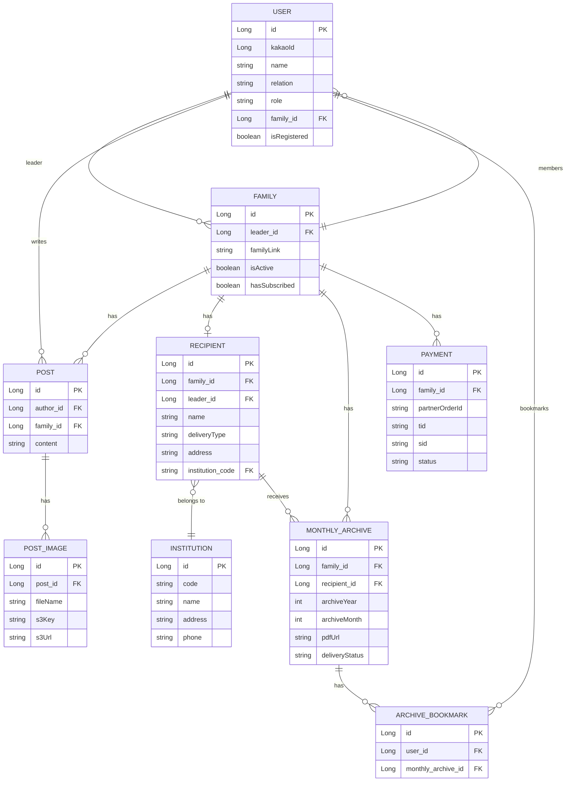
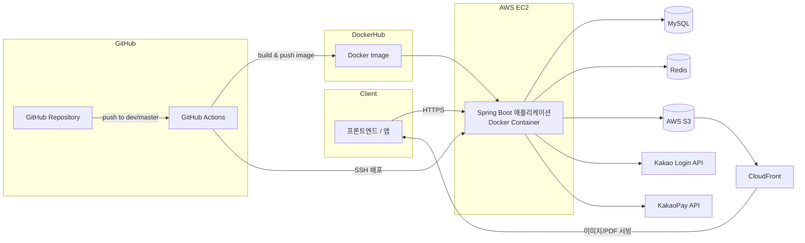

# 이어드림(DearDream) Backend

> 멀리 떨어진 가족과 요양·복지 시설에 계신 어르신을 사진과 글로 이어주는 서비스, **이어드림**의 백엔드 서버입니다.

---

## 📌 프로젝트 소개

이어드림은 요양원 등 시설에 계신 어르신과 떨어져 지내는 가족을 위한 서비스입니다. 가족 구성원들은 일상 속 사진과 짧은 글을 꾸준히 남기고, 서버는 매월 이를 모아 한 권의 **월간 아카이브(PDF 포토북)** 로 자동 제작합니다. 완성된 아카이브는 어르신이 계신 **기관으로 방문 전달**되거나 **가정으로 배송**되어, 가족의 소식을 전할 수 있도록 돕습니다.

- 👋카카오 계정으로 간편하게 로그인하고, 가족 그룹을 만들어 초대 링크로 구성원을 모아요.
- 👵 대표자(리더)는 어르신(수신자) 정보와 배송지(기관/자택)를 등록합니다.
- 📝 가족 구성원은 사진과 글로 게시물을 작성합니다.
- 📚 매월 1일, 지난 한 달간의 게시물을 모아 PDF 아카이브가 자동 생성됩니다.
- 💳 카카오페이 정기결제를 통해 매달 구독료가 자동으로 결제되고, 아카이브 제작과 배송이 이어집니다.

## 🎯 프로젝트 목표

- 바쁜 일상 속에서도 가족이 부담 없이 안부를 전할 수 있는 **가장 쉬운 기록 방법**을 제공한다.
- 온라인 기록을 **실물 포토북(PDF)** 형태로 변환해, 디지털 기기 사용이 익숙하지 않은 어르신도 소식을 받아볼 수 있게 한다.
- 정기결제·자동화 스케줄러를 통해 **한 번 설정하면 매달 자동으로** 아카이브가 제작·배송되는 경험을 만든다.

## 🛠 기술 스택

| 분류                 | 기술                                                     |
|--------------------|--------------------------------------------------------|
| Language / Runtime | Java 17                                                |
| Framework          | Spring Boot 3.4.5, Spring Web, Spring Data JPA         |
| 인증/인가              | Spring Security, OAuth2 Client(Kakao Login), JWT(jjwt) |
| Database           | MySQL                                                  |
| Cache / Session    | Redis (Refresh Token 등 저장)                             |
| 파일 저장소             | AWS S3, CloudFront                                     |
| 결제                 | KakaoPay (정기 결제)                                       |
| 문서화                | springdoc-openapi(Swagger UI)                          |
| 파일 렌더링             | Thymeleaf, OpenHTMLtoPDF, Flying Saucer(PDF 변환)        |
| 빌드                 | Gradle                                                 |
| 배포                 | Docker, GitHub Actions, AWS EC2                        |

## 🧩 서비스 및 인프라 구성

도메인은 기능 단위로 아래와 같이 나뉘어 있습니다.

| 도메인           | 역할                                  |
|---------------|-------------------------------------|
| `auth`        | 카카오 로그인, JWT 발급/재발급/로그아웃            |
| `user`        | 회원 가입(프로필 등록), 내 정보 조회·수정·탈퇴        |
| `family`      | 가족 그룹 생성, 초대 링크 발급, 초대 링크로 합류       |
| `recipient`   | 어르신(수신자) 정보 및 배송지(기관/자택) 등록·수정      |
| `institution` | 요양원 등 기관 정보 등록·조회, 기관 소속 사용자 관리     |
| `post`        | 게시물(사진 + 글) 작성, 수정, 삭제, 조회          |
| `archive`     | 월간 아카이브(PDF) 생성·조회, 배송 상태 관리, 북마크   |
| `payment`     | 카카오페이 결제 준비/승인/환불, 정기 구독 관리         |
| `jwt`         | JWT 발급·검증 공통 유틸                     |
| `global`      | 공통 응답/예외 처리, 보안·CORS·S3·타임존 등 공통 설정 |

인프라 관점에서는 **EC2 위에서 Docker 컨테이너로 애플리케이션을 실행**하고, MySQL·Redis에 연결하며, 이미지·PDF 파일은 S3 + CloudFront로 서빙합니다. 외부 연동으로 카카오 로그인 API, 카카오페이 API를 사용합니다.

## 🔑 핵심 비즈니스 로직

<strong>1. 카카오 로그인 & JWT 인증</strong>

- 프론트엔드에서 전달받은 인가 코드(`code`)로 카카오 사용자 정보를 조회하고, 최초 로그인 시 사용자를 생성합니다.
- 로그인 성공 시 Access/Refresh Token을 발급하며, Refresh Token은 Redis에 저장해 재발급(`/api/users/reissue`)과 로그아웃 시 무효화에 사용합니다.
- 이후 모든 API 요청은 `JwtAuthenticationFilter`가 Access Token을 검증해 인증을 수행합니다.

<strong>2. 가족 그룹 생성 & 초대</strong>

- 최초로 프로필을 등록한 사용자는 가족 그룹(`Family`)을 만들며 자동으로 대표자(`LEADER`)가 됩니다.
- 대표자는 초대 링크를 발급할 수 있고, 다른 사용자는 초대 링크로 가족 그룹에 합류(`USER`)합니다.
- 대표자가 탈퇴하면 남은 구성원의 역할은 `DEFAULT`로 초기화됩니다.

<strong>3. 수신자(어르신) 및 배송지 등록</strong>

- 대표자는 수신자(어르신)의 기본 정보(이름, 생일, 프로필 사진)와 배송 방식을 등록합니다.
- 배송 방식은 `기관 방문(INSTITUTION)` 또는 `자택 배송(HOME)` 중 선택하며, 기관을 선택한 경우 소속 기관(`Institution`)을 코드로 연결합니다.

<strong>4. 게시물(사진 + 글) 작성</strong>

- 가족 구성원은 사진과 최대 1,000자 글로 게시물을 작성하며, 여러 장의 이미지를 첨부할 수 있습니다(`PostImage`).
- 이미지는 S3에 업로드되고, 업로드된 파일의 key/URL이 함께 저장됩니다.

<strong>5. 월간 아카이브 자동 생성</strong>

- 매월 1일 자정, 스케줄러(`ArchiveScheduler`)가 지난 한 달간 가족별 게시물을 모아 Thymeleaf 템플릿 기반 HTML을 PDF로 변환합니다.
- 생성된 PDF는 S3에 저장되고 `MonthlyArchive`로 관리되며, 배송 상태(`준비 중 → 배달 중 → 배달 완료`)가 갱신됩니다.
- 사용자는 지난 아카이브를 북마크(즐겨찾기)할 수 있습니다.

<strong>6. 카카오페이 정기 구독 결제</strong>

- 최초 결제는 카카오페이 결제 준비(ready) → 승인(approve) 과정을 거치며, 승인 시 정기결제용 `sid`를 발급받아 저장합니다.
- 매일 자정 스케줄러(`SubscriptionScheduler`)가 결제 만료일이 도래한 구독 건을 조회해 `sid`로 자동 재결제를 수행합니다.
- 결제가 실패하면 자동으로 구독을 비활성화(`inactiveSubscription`)하고, 사용자는 이후 재구독(`rejoin`)할 수 있습니다.

## 🗂 ERD

## 📑 API 명세서

서버 실행 후 아래 경로에서 전체 API 명세를 Swagger UI로 확인할 수 있습니다.

- ~~Local: `http://localhost:8080/swagger-ui/index.html`~~
- ~~Production: `https://vote-dream.p-e.kr/swagger-ui/index.html`~~

주요 엔드포인트는 다음과 같습니다.

| 도메인         | Method    | URL                                              | 설명                       |
|-------------|-----------|--------------------------------------------------|--------------------------|
| Auth        | GET       | `/api/users/login/kakao`                         | 카카오 로그인                  |
| Auth        | POST      | `/api/users/reissue`                             | Access/Refresh Token 재발급 |
| Auth        | POST      | `/api/users/logout`                              | 로그아웃                     |
| User        | POST      | `/api/v1/users/register`                         | 회원가입(프로필 등록)             |
| User        | GET       | `/api/v1/users/me`                               | 내 정보 조회                  |
| User        | PATCH     | `/api/v1/users/me`                               | 내 정보 수정                  |
| User        | DELETE    | `/api/v1/users/me`                               | 회원 탈퇴                    |
| Family      | POST      | `/api/v1/family`                                 | 가족 그룹 생성                 |
| Family      | GET       | `/api/v1/family`                                 | 내 가족 정보 조회               |
| Family      | POST      | `/api/v1/family/link`                            | 초대 링크 생성                 |
| Family      | POST      | `/api/v1/family/join`                            | 초대 링크로 가족 합류             |
| Recipient   | GET       | `/api/v1/recipient`                              | 수신자(어르신) 정보 조회           |
| Recipient   | POST      | `/api/v1/recipients`                             | 수신자 등록                   |
| Recipient   | PATCH     | `/api/v1/recipients/{recipientId}`               | 수신자 배송지 수정               |
| Institution | GET       | `/api/v1/institutions`                           | 기관 코드로 기관 정보 확인          |
| Institution | POST      | `/api/v1/institutions/admin`                     | 기관 등록(관리자)               |
| Post        | POST      | `/api/v1/posts`                                  | 게시물 작성(이미지 포함)           |
| Post        | GET       | `/api/v1/posts/{familyId}`                       | 가족 게시물 목록 조회             |
| Post        | PUT/PATCH | `/api/v1/posts/{postId}`                         | 게시물 수정                   |
| Post        | DELETE    | `/api/v1/posts/{postId}`                         | 게시물 삭제                   |
| Archive     | GET       | `/api/v1/archives/{familyId}`                    | 가족의 월간 아카이브 목록 조회        |
| Archive     | POST      | `/api/v1/archives/{archiveId}/bookmark`          | 아카이브 북마크 토글              |
| Payment     | POST      | `/api/v1/test/payment/ready`                     | 카카오페이 결제 준비              |
| Payment     | GET       | `/api/v1/test/payment/success`                   | 카카오페이 결제 승인 콜백           |
| Payment     | POST      | `/api/v1/test/payment/subscription/inactive`     | 정기 구독 해지                 |
| Payment     | GET       | `/api/v1/test/payment/request/status/{familyId}` | 구독 상태 조회                 |

## 🏗 인프라 아키텍처

## 🚀 CI/CD

`.github/workflows/cicd.yml` 기준으로, `dev` / `master` 브랜치에 push되면 아래 파이프라인이 자동으로 실행됩니다.

1. **체크아웃 & JDK 17 설정**
2. **운영 설정 파일 생성**: GitHub Secrets 값을 `application-prod.yml`의 플레이스홀더에 주입
3. **Gradle 빌드**: `./gradlew bootJar -x test`
4. **Docker 이미지 빌드**: 빌드된 jar를 기반으로 이미지 생성
5. **Docker Hub 로그인 & 이미지 Push**
6. **EC2 배포**: SSH로 EC2 서버에 접속해 기존 컨테이너를 중지·삭제하고, 새로 push된 이미지를 pull하여 `--network host` 모드로 재기동 (`SPRING_PROFILES_ACTIVE=prod`)
